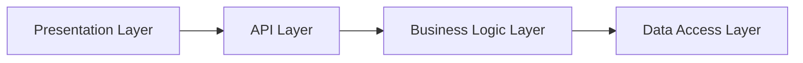
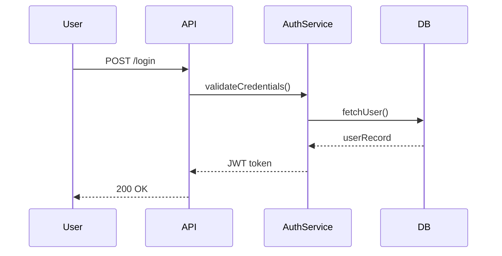
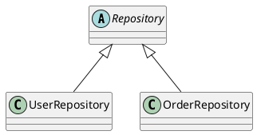
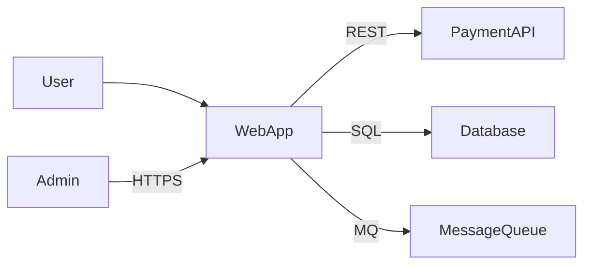
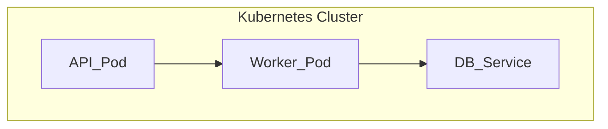
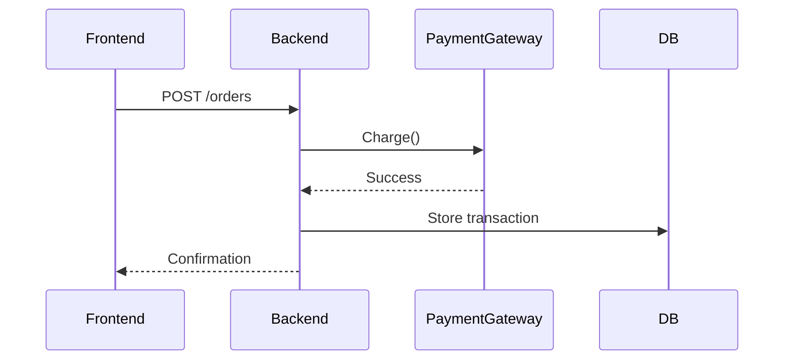

# AppDoc Diagram Generation Ruleset (v1.0)

## PURPOSE
This ruleset defines how AppDoc Agent generates **architecture diagrams** with high-confidence accuracy.  
Diagrams are built using static code evidence (imports, configs, and structural patterns) and stored in `/Documentation/.meta/diagrams/`.  
Only relationships with confidence ≥ 0.75 are visualized.

## Confidence aggregation and exclusion
When only one evidence source applies to a relationship, its confidence value is used as-is. When multiple evidence rules (e.g., import, function call, naming) apply, aggregate confidence by taking the maximum confidence across all applicable rules (max rule) to surface the strongest evidence. Any relationship with aggregated confidence < 0.75—including those labeled "inferred by naming only"—is excluded from the diagram.

---

## 1. MODULE / SERVICE DEPENDENCY GRAPH
**Goal:** Show internal dependencies between modules or services.

### Evidence Sources:
- Import/require/using statements
- Dependency injection registrations
- Cross-file function calls

### Confidence Rules:
- Import between distinct folders → 0.95 (apply max(confidences) aggregation, exclude if < 0.75)
- Cross-file function call → 0.9 (apply max(confidences) aggregation, exclude if < 0.75)
- Shared variable / global reference → 0.8 (apply max(confidences) aggregation, exclude if < 0.75)
- Inferred by naming only → exclude (confidence < 0.75)

### Output:
`dependency-graph.mmd`
```mermaid
graph TD
    $MODULE_A --> $MODULE_B
    $MODULE_B --> $MODULE_C
````

### Example Node Data:
```json
{
  "modules": [
    {"name": "UserService", "path": "services/user.cs"},
    {"name": "AuthController", "path": "controllers/auth.cs"}
  ],
  "links": [
    {"source": "AuthController", "target": "UserService", "confidence": 0.95}
  ]
}
```

---

## 2. LAYERED APPLICATION ARCHITECTURE

**Goal:** Show code organization across logical tiers.

### Evidence Sources:

* Folder / namespace patterns (`/api/`, `/service/`, `/db/`, `/ui/`)
* Class naming (`*Controller`, `*Repository`, `*Service`)
* File dependency direction

### Confidence Rules:

* Folder pattern match → 0.95
* Class suffix match → 0.9
* Dependency direction → 0.85

### Output:

`layered-architecture.mmd`



### Notes:

* AppDoc auto-aggregates components by layer based on naming conventions.
* Unclassified files are listed under “Miscellaneous Layer”.

---

## 3. COMPONENT INTERACTION FLOW

**Goal:** Visualize request or workflow sequence inside the app.

### Evidence Sources:

* HTTP routes, controllers, CLI entrypoints
* Function call chains
* Request/response handling patterns

### Confidence Rules:

* Route or endpoint with direct service call → 0.95 (apply max(confidences) aggregation, exclude if < 0.75)
* Multi-step call chain → 0.85 (apply max(confidences) aggregation, exclude if < 0.75)
* Inferred by naming only → exclude (confidence < 0.75)

### Output:

`component-flow.mmd`



---

## 4. CLASS / INTERFACE HIERARCHY

**Goal:** Map inheritance and interface implementation.

### Evidence Sources:

* `class X : Y`, `implements`, `extends` statements (AST-level)
* Abstract class definitions

### Confidence Rules:

* Explicit inheritance → 0.98
* Interface implementation → 0.95
* Abstract base inference → 0.9

### Output:

`class-hierarchy.puml`



---

## 5. SYSTEM CONTEXT DIAGRAM (EXTERNAL INTEGRATIONS)

**Goal:** Depict interactions with external systems.

### Evidence Sources:

* Config values containing URLs, hostnames, ports
* API client imports (`requests`, `axios`, `HttpClient`, etc.)
* Database connection strings or ORM config
* Queue/broker client code (Kafka, RabbitMQ, etc.)

### Confidence Rules:

* Explicit API or DB call → 0.95
* External endpoint in config file → 0.9
* Inferred third-party SDK usage → 0.8 (excluded unless confirmed by multiple signals)

### Output:

`system-context.mmd`



### Metadata:

AppDoc writes a `.meta/system-integrations.json` file with:

```json
{
  "external_systems": [
    {"name": "Database", "type": "PostgreSQL", "source": "appsettings.json:12", "confidence": 0.95},
    {"name": "PaymentAPI", "type": "REST", "source": "services/payment.cs:88", "confidence": 0.9}
  ]
}
```

---


## 6. DEPLOYMENT TOPOLOGY (WHEN INFRA DETECTED)

**Goal:** Show runtime deployment structure.

### Evidence Sources:

Infrastructure detection is based on the presence of any of the following file patterns or heuristics:
- `Dockerfile`
- `docker-compose.yml` or `docker-compose.yaml`
- Any file under `**/k8s/**`
- Any `*.yaml` or `*.yml` containing `kind: Deployment` or `kind: Service`
- Any `*.tf` (Terraform)
- `.github/workflows/*.yml` (GitHub Actions)
- `Jenkinsfile`

### Fallback Behavior:
If none of the above infra files are found:
- Skip generation of the deployment-topology diagram
- Emit a warning and optionally generate a diagram from code inference, flagged as low-confidence
- In `diagrams.index.json`, only include `deployment-topology` if generated; otherwise, omit the entry or include a placeholder with `status: skipped` and a `reason` field

### Confidence Rules:
- Service definition found in infra file → 0.95
- Network link or volume mount in infra file → 0.9
- Inferred container from naming only (without corroborating infra file) → exclude

### Output:
`deployment-topology.mmd`



---

## 7. DATA FLOW / INTEGRATION SEQUENCE

**Goal:** Illustrate high-confidence external data movement.

### Evidence Sources:

* I/O operations (API requests, file reads/writes)
* Messaging or queue operations
* Explicit serialization/deserialization in code

### Confidence Rules:

* Network or DB I/O confirmed → 0.9+
* Single unverified call → exclude

### Output:

`dataflow-sequence.mmd`



---

## 8. VERSIONED OUTPUTS

Each diagram should include metadata headers:


```json
{
  "diagram_version": "1.0",
  "generated_at": "$DATE_GENERATED",
  "confidence_threshold": 0.75,
  "source_count": "$FILES_SCANNED"
}
```

AppDoc writes a `diagrams.index.json` for quick reference:

```json
{
  "diagrams": [
    {"name": "dependency-graph", "confidence": 0.95, "path": ".meta/diagrams/dependency-graph.mmd"},
    {"name": "system-context", "confidence": 0.92, "path": ".meta/diagrams/system-context.mmd"}
  ]
}
```

---

## 9. EXCLUSION RULES

AppDoc must **not** render diagrams for:

* Confidence < 0.75
* Unverified external references (e.g., commented URLs)
* Test-only mocks or stubs
* Dynamic imports (`importlib`, `require(var)`)
* Files marked as “generated” or “vendor/”

---

## 10. FUTURE EXTENSIONS (Optional)

When runtime data, logs, or telemetry become available:

* Enable change-impact graphs (component volatility)
* Generate failure propagation trees (cross-component error chains)
* Create test coverage overlays

---

*(End of Ruleset — AppDoc Diagram Generation v1.0)*


