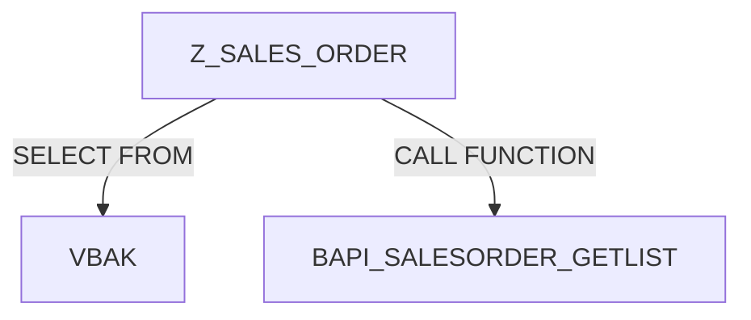

```
/patterns/languages/ABAP.md
```

---

````markdown
# ABAP Pattern Pack — AppDocU v6.1

## PURPOSE
Enable structured extraction of architecture, logic, and integration patterns from ABAP repositories or exported source files.  
Supports classic `.abap`, `.sap`, or SAPLink-exported objects.

---

## 1. FILE SIGNATURES

```json
{
  "extensions": [".abap", ".sap", ".src"],
  "handler": "abap_parser",
  "language": "abap",
  "keywords": ["REPORT", "PROGRAM", "FUNCTION", "METHOD", "CLASS", "FORM", "SELECT"]
}
````

---

## 2. PRIMARY STRUCTURE PATTERNS

### 2.1 Programs & Reports

```regex
(?i)^\s*(REPORT|PROGRAM)\s+([A-Z0-9_]+)
```

**Capture:**

* `type`: Report / Program
* `name`: program identifier

---

### 2.2 Includes

```regex
(?i)^\s*INCLUDE\s+([A-Z0-9_]+)
```

Used to track logical decomposition and reuse.

---

### 2.3 Function Modules

```regex
(?i)FUNCTION\s+([A-Z0-9_]+)\b([\s\S]*?)ENDFUNCTION
```

**Extract:**

* Function name
* Local variables (`DATA:` / `TABLES:` / `PARAMETERS:`)
* CALL FUNCTION invocations (dependencies)

---

### 2.4 Classes & Methods

```regex
(?i)CLASS\s+([A-Z0-9_]+)\s+DEFINITION([\s\S]*?)ENDCLASS.
```

```regex
(?i)METHODS?\s+([A-Z0-9_]+)
```

```regex
(?i)METHOD\s+([A-Z0-9_]+)[\s\S]*?ENDMETHOD.
```

**Extract:**

* Class name
* Method names
* Visibility (PUBLIC / PRIVATE / PROTECTED)
* Inheritance (INHERITING FROM …)

---

### 2.5 FORM Routines

```regex
(?i)FORM\s+([A-Z0-9_]+)[\s\S]*?ENDFORM.
```

Legacy procedural entry points.

---

## 3. DATA & CONFIGURATION

### 3.1 Variable Definitions

```regex
(?i)DATA\s*:\s*([\s\S]*?)(?=\.)
```

Record declared variables and inferred types.

### 3.2 Parameters / Select-Options

```regex
(?i)(PARAMETERS|SELECT-OPTIONS)\s*:\s*([A-Z0-9_]+)
```

User input interfaces.

### 3.3 Constant Declarations

```regex
(?i)CONSTANTS\s*:\s*([A-Z0-9_]+)
```

---

## 4. INTEGRATION PATTERNS

### 4.1 RFC and BAPI Calls

```regex
(?i)CALL\s+FUNCTION\s+(['"]?)(Z|BAPI_)[A-Z0-9_]+\1
```

Flag these as **remote or business API calls**; record parameters if available.

### 4.2 Database Access

```regex
(?i)SELECT\s+[\s\S]*?\s+FROM\s+([A-Z0-9_]+)
```

Infer affected SAP tables → treat as **data layer dependency**.

### 4.3 External System Links

```regex
(?i)CALL\s+(TRANSACTION|WEBSERVICE|HTTP)\s+([A-Z0-9_]+)
```

Detect external integration points.

---

## 5. COMMENT & DOC EXTRACTION

ABAP uses `*` or `"`.
Extract lines beginning with either symbol as documentation.

```regex
^(?:\*|").*
```

### In-Code Doc Tags

Look for:

```
" @purpose, " @author, " @param, " @return
```

Convert these into docstring-like annotations for **logic-and-workflows.md**.

---

## 6. SECURITY & COMPLIANCE CUES

Flag patterns:

* Hardcoded credentials

  ```regex
  (?i)PASSWORD\s*=\s*['"].+['"]
  ```
* Direct table updates

  ```regex
  (?i)UPDATE\s+[A-Z0-9_]+\s+SET
  ```
* Unchecked RFC calls (no `EXCEPTIONS` handling)

  ```regex
  (?i)CALL\s+FUNCTION\s+.*?(?<!EXCEPTIONS)\.
  ```

---

## 7. OUTPUT MAPPING

Each match should output a JSON node like:

```json
{
  "component": "ZSALES_ORDER",
  "type": "FUNCTION",
  "methods": ["GET_ORDER", "UPDATE_ORDER"],
  "calls": ["BAPI_SALESORDER_GETLIST"],
  "tables": ["VBAK", "VBAP"],
  "external_dependencies": ["RFC:BAPI_SALESORDER_GETLIST"],
  "doc_comments": ["Retrieves sales order header and item details"],
  "security_flags": ["Direct table access (UPDATE VBAK)"]
}
```

---

## 8. CONFIDENCE RULES

| Confidence | Condition                                                 |
| ---------- | --------------------------------------------------------- |
| HIGH       | Function or class explicitly declared and closed properly |
| MEDIUM     | Partial block (missing END*) but name inferred            |
| LOW        | Only mentions found (e.g., BAPI calls) without context    |

---

## 9. DIAGRAM SUPPORT

Pass structured data to the diagram orchestrator to visualize:

* Module → Function → Table relationships
* RFC call graph
* Dataflow: internal SELECT/UPDATE → external CALL FUNCTION

Example (Mermaid):



---

## 10. NOTES

* ABAP often mixes procedural and OO; both patterns must be supported concurrently.
* SAP systems may store objects in transport or export format — patterns are resilient to that.
* ABAP naming conventions (Z* for custom, Y* for test) can be used to infer ownership and confidence.

---

**End of ABAP Pattern Pack v1.0**

```

---

### 📂 Integration

Save this as:
```

/patterns/languages/ABAP.md

````

Then, in your `patterns/index.json`, add:
```json
{
  "language": "abap",
  "pattern_file": "patterns/languages/ABAP.md",
  "handler": "abap_parser"
}
````


