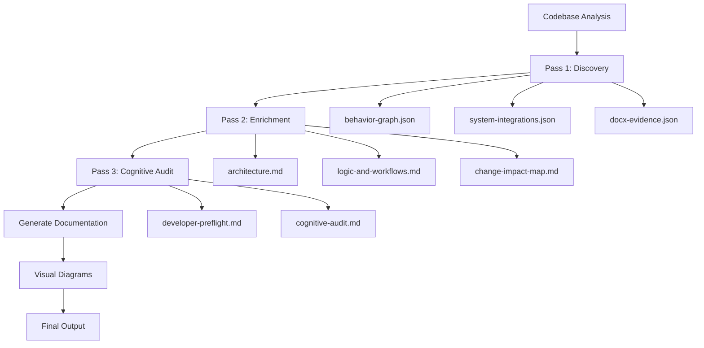

# AppDocU

AppDocU is a template-driven documentation automation system designed to extract, analyze, and generate comprehensive documentation for any codebase. It is built for extensibility, auditability, and non-destructive workflows, making it ideal for teams seeking reliable, versioned documentation.

## How It Works



## What You Get

| Architecture Overview | Logic & Workflows | Troubleshooting Guide |
|----------------------|-------------------|----------------------|
| System thesis and layered overview with Mermaid diagrams | Source → Inputs → Transformations → Outputs → Presentation tables | Evidence-based diagnostic steps with confidence ratings |
## Quick Start - Run the Workflow

```bash
# Clone the repository
git clone <repo-url>
cd AppDocU

# Run end-to-end documentation generation
python appdoc.py --target /path/to/your/codebase

# Or run individual passes
python appdoc.py --pass 1 --target /path/to/your/codebase  # Discovery
python appdoc.py --pass 2 --target /path/to/your/codebase  # Enrichment  
python appdoc.py --pass 3 --target /path/to/your/codebase  # Cognitive Audit
```

## User Goals → Which Prompt to Run

| User Goal | Prompt to Run | Output Generated |
|-----------|---------------|------------------|
| Understand codebase structure | `.github/prompts/pass1.discovery.md` | `behavior-graph.json`, `system-integrations.json` |
| Generate human-readable docs | `.github/prompts/pass2.enrichment.md` | `architecture.md`, `logic-and-workflows.md` |
| Risk assessment & preflight | `.github/prompts/pass3.cognitive.audit.md` | `developer-preflight.md`, `cognitive-audit.md` |
| Generate visual diagrams | `.github/prompts/diagrams/generate.all.diagrams.prompt.md` | `diagrams/*.mmd` |
| Full documentation suite | `.github/prompts/appdocument.workflow.prompt.md` | Complete documentation set |

## Key Features

- **Template-Based Architecture:** All documentation is generated using Markdown templates found in `appdoc.templates/`. This ensures consistency and easy customization.
- **Multi-Stage Workflow:** The system uses workflow prompts (in `.github/prompts/`) to orchestrate multi-phase documentation processes, including analysis, drafting, and auditing.
- **Behavior Graph Analysis:** Discovers runtime behavior through IO operations, database calls, API calls, and event flows.
- **Cognitive Audit:** Proactive risk assessment with fragility analysis and predicted failure chains.
- **Visual Diagram Generation:** Automatic Mermaid diagram creation for architecture, dependencies, and data flows.
- **Non-Destructive Principle:** Data gaps and uncertainties are preserved as placeholders, never overwritten or fabricated, ensuring traceable and actionable documentation.
- **Version Tracking:** Documentation versions are managed and tracked, supporting incremental updates and historical audits.

## Directory Structure

- `appdoc.templates/`: Core Markdown templates for architecture, audit reports, logic/workflows, documentation tasks, and troubleshooting playbooks.
- `.github/prompts/`: Workflow prompt files that drive documentation automation and agent behavior.
- `patterns/`: Language-specific pattern definitions for Python, C#, JavaScript, SQL, React, ABAP, etc.
- `examples/minishop/`: Sample multi-language toy repository with expected outputs.
- `.github/copilot-instructions.md`: Persistent instructions for AI coding agents, detailing conventions, workflow mandates, and integration points.

## Getting Started

1. Review the templates in `appdoc.templates/` to understand documentation structure.
2. Read `.github/copilot-instructions.md` for agent guidance and workflow details.
3. Try the sample project: `cd examples/minishop && python appdoc.py --target .`
4. Use or modify workflow prompts in `.github/prompts/` to automate documentation generation.

---
_Last updated: October 24, 2025_
