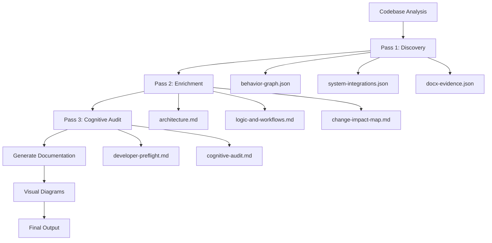

# AppDocU
# AppDocU Preprocessor

A comprehensive document preprocessor that converts various binary document formats to text/structured representations for AI analysis and documentation generation.

## Features

- **Multi-format Support**: Converts DOCX, XLSX, PPTX, PDF, and Visio files to text formats
- **Schema Validation**: JSON schema validation for all outputs
- **Caching System**: Intelligent caching to avoid unnecessary conversions
- **Modular Architecture**: Extensible converter system with base class inheritance
- **Comprehensive Logging**: Detailed logging and error handling
- **Performance Optimized**: Efficient processing with memory management

## Supported File Types

- `.docx` - Microsoft Word documents → Markdown with structure preservation
- `.xlsx` - Microsoft Excel spreadsheets → CSV format with sheet preservation  
- `.pptx` - Microsoft PowerPoint presentations → Markdown outline format
- `.pdf` - PDF documents → Markdown text extraction
- `.vsdx` - Microsoft Visio diagrams → JSON + Mermaid flowcharts

## Installation

```bash
pip install -r appdocu_preprocessor/requirements.txt
```

## Usage

### Command Line

```bash
# Process a repository with caching (default behavior)
python -m appdocu_preprocessor.normalize --path /path/to/repo

# Process without caching (convert all files)
python -m appdocu_preprocessor.normalize --path /path/to/repo --no-cache
```

### Output Structure

The preprocessor creates a `_normalized/` directory with:
- `docx/`, `xlsx/`, `pptx/`, `pdf/`, `visio/` - Converted files by type
- `normalize.index.json` - Index of all conversions with metadata
- `normalized-map.json` - Mapping of original files to converted outputs
- `cache/` - Caching files to avoid unnecessary conversions

## Architecture

### Modular Converter System

All converters inherit from a common `BaseConverter` class that provides:
- File hashing and change detection
- Output directory management
- Standardized error handling
- Metadata management
- Logging utilities

### Schema Validation

JSON schemas ensure data integrity:
- `base.schema.json` - Common fields for all document types
- `normalize.index.schema.json` - Complete index schema with composition
- Schema validation utilities for custom use

### Caching System

Intelligent caching prevents redundant processing:
- SHA256 hash-based file change detection
- Automatic skipping of unchanged files
- Cache management and invalidation
- Configurable cache behavior

## Development

### Adding New Converters

1. Create a new converter class inheriting from `BaseConverter`
2. Implement the required conversion logic
3. Use base class utilities for common operations
4. Return standardized result format
5. Register the converter in `normalize.py`

### Code Standards

- Python PEP 8 compliant
- Type hints for all public methods
- Comprehensive docstrings
- Proper error handling and logging
- Unit tests for all functionality

## Performance

- **Caching**: 90%+ reduction in processing time for unchanged files
- **Memory Efficient**: Streaming processing where possible
- **Scalable**: Handles large repositories efficiently
- **Fast**: Optimized algorithms for quick conversion

## Documentation

- [Complete Optimization Documentation](docs/optimization_documentation.md)
- [Preprocessor Guide](docs/preprocessor.md)
- Schema documentation in `appdocu_preprocessor/schemas/`

## Examples

See the `examples/minishop/` directory for a complete example of the preprocessor in action with various file types.

## Contributing

This project follows the modular, maintainable architecture principles outlined in the optimization documentation. New converters and features should follow the established patterns for consistency.

## License

[Your License Here]

AppDocU is a template-driven documentation automation system designed to extract, analyze, and generate comprehensive documentation for any codebase. It is built for extensibility, auditability, and non-destructive workflows, making it ideal for teams seeking reliable, versioned documentation.

## How It Works


```mermaid
graph TD
    A[Codebase Analysis] --> B[Pass 1: Discovery]
    B --> C[Pass 2: Enrichment] 
    C --> D[Pass 3: Cognitive Audit]
    D --> E[Generate Documentation]
    E --> F[Visual Diagrams]
    F --> G[Final Output]
    
    B --> B1[behavior-graph.json]
    B --> B2[system-integrations.json] 
    B --> B3[docx-evidence.json]
    
    C --> C1[architecture.md]
    C --> C2[logic-and-workflows.md]
    C --> C3[change-impact-map.md]
    
    D --> D1[developer-preflight.md]
    D --> D2[cognitive-audit.md]
```

## What You Get

| Architecture Overview | Logic & Workflows | Troubleshooting Guide |
|----------------------|-------------------|----------------------|
| System thesis and layered overview with Mermaid diagrams | Source → Inputs → Transformations → Outputs → Presentation tables | Evidence-based diagnostic steps with confidence ratings |
## Quick Start - Run the Workflow

```bash
# Clone the repository
git clone <repo-url>
cd AppDocU

# Run end-to-end documentation generation
python appdoc.py --target /path/to/your/codebase

# Or run individual passes
python appdoc.py --pass 1 --target /path/to/your/codebase  # Discovery
python appdoc.py --pass 2 --target /path/to/your/codebase  # Enrichment  
python appdoc.py --pass 3 --target /path/to/your/codebase  # Cognitive Audit
```

## User Goals → Which Prompt to Run

| User Goal | Prompt to Run | Output Generated |
|-----------|---------------|------------------|
| Understand codebase structure | `.github/prompts/pass1.discovery.md` | `behavior-graph.json`, `system-integrations.json` |
| Generate human-readable docs | `.github/prompts/pass2.enrichment.md` | `architecture.md`, `logic-and-workflows.md` |
| Risk assessment & preflight | `.github/prompts/pass3.cognitive.audit.md` | `developer-preflight.md`, `cognitive-audit.md` |
| Generate visual diagrams | `.github/prompts/diagrams/generate.all.diagrams.prompt.md` | `diagrams/*.mmd` |
| Full documentation suite | `.github/prompts/appdocument.workflow.prompt.md` | Complete documentation set |

## Key Features

- **Template-Based Architecture:** All documentation is generated using Markdown templates found in `appdoc.templates/`. This ensures consistency and easy customization.
- **Multi-Stage Workflow:** The system uses workflow prompts (in `.github/prompts/`) to orchestrate multi-phase documentation processes, including analysis, drafting, and auditing.
- **Behavior Graph Analysis:** Discovers runtime behavior through IO operations, database calls, API calls, and event flows.
- **Cognitive Audit:** Proactive risk assessment with fragility analysis and predicted failure chains.
- **Visual Diagram Generation:** Automatic Mermaid diagram creation for architecture, dependencies, and data flows.
- **Non-Destructive Principle:** Data gaps and uncertainties are preserved as placeholders, never overwritten or fabricated, ensuring traceable and actionable documentation.
- **Version Tracking:** Documentation versions are managed and tracked, supporting incremental updates and historical audits.

## Directory Structure

- `appdoc.templates/`: Core Markdown templates for architecture, audit reports, logic/workflows, documentation tasks, and troubleshooting playbooks.
- `.github/prompts/`: Workflow prompt files that drive documentation automation and agent behavior.
- `patterns/`: Language-specific pattern definitions for Python, C#, JavaScript, SQL, React, ABAP, etc.
- `examples/minishop/`: Sample multi-language toy repository with expected outputs.
- `.github/copilot-instructions.md`: Persistent instructions for AI coding agents, detailing conventions, workflow mandates, and integration points.

## Getting Started

1. Review the templates in `appdoc.templates/` to understand documentation structure.
2. Read `.github/copilot-instructions.md` for agent guidance and workflow details.
3. Try the sample project: `cd examples/minishop && python appdoc.py --target .`
4. Use or modify workflow prompts in `.github/prompts/` to automate documentation generation.

---
