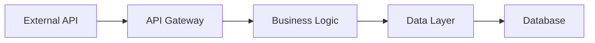

# $ARGUMENTS — Architecture Overview

---
# METADATA
---
title: "Architecture"
app: "$ARGUMENTS"
template: "architecture.template.md"
version: "4.0"
doc_version: "$DOC_VERSION"
generated_by: "AppDoc Agent v7.0"
generated_at: "$DATE_GENERATED"
code_last_modified: "$LAST_CODE_CHANGE_DATE"
sources_scanned: $SOURCES_SCANNED
language_handlers_used: $LANGUAGE_HANDLERS
previous_doc_version: "$PREV_DOC_VERSION"
---

## System Thesis
$SYSTEM_THESIS[CONFIDENCE:HIGH]

<details>
<summary>Version History & Changes (click to expand)</summary>

### Changes Since Last Version
$VERSION_CHANGES_SUMMARY

### Previous Versions
- v$PREV_VERSION: Generated $PREV_DATE
- [Link to previous version: .meta/previous/architecture-v$PREV_VERSION.md]

</details>

---

## 1. Application Summary
- **Purpose:** $APP_DESCRIPTION_PURPOSE[CONFIDENCE:HIGH]
- **Primary Functionality:** $APP_FEATURE_SUMMARY[CONFIDENCE:HIGH]
- **Primary Audience / Consumers:** $APP_AUDIENCE[CONFIDENCE:MEDIUM]
- **Core Technologies (detected):** $TECH_STACK_PRIMARY[CONFIDENCE:HIGH]
- **Language Handler Used:** $LANGUAGE_HANDLER_TYPE (Confidence: $HANDLER_CONFIDENCE)
- **Primary Entry Points / Binaries:** $CODE_ENTRYPOINT_LIST[CONFIDENCE:HIGH]
- **Major Dependencies & Libraries:** $DEPENDENCY_LIST[CONFIDENCE:HIGH]
- **Build / Run Environment:** $ENVIRONMENT_DETAILS[CONFIDENCE:MEDIUM]

---

## 2. System Architecture

<details open>
<summary>2.1 Layered Overview</summary>

| Layer | Purpose | Primary Modules | Key Dependencies | Confidence |
|-------|---------|-----------------|------------------|------------|
| Controller/HTTP | $LAYER_CONTROLLER_PURPOSE | $LAYER_CONTROLLER_MODULES | $LAYER_CONTROLLER_DEPENDENCIES | HIGH |
| Business Logic | $LAYER_LOGIC_PURPOSE | $LAYER_LOGIC_MODULES | $LAYER_LOGIC_DEPENDENCIES | HIGH |
| Repository/DB | $LAYER_REPO_PURPOSE | $LAYER_REPO_MODULES | $LAYER_REPO_DEPENDENCIES | HIGH |
| External | $LAYER_EXTERNAL_PURPOSE | $LAYER_EXTERNAL_MODULES | $LAYER_EXTERNAL_DEPENDENCIES | MEDIUM |

**Note:** Layered architecture following Controller → Service → Repository → External pattern. See behavior-graph.json for detailed call flows.
</details>

<details>
<summary>2.2 Internal Component Graph (click to expand)</summary>

**Generated from behavior-graph.json:**


</details>

<details>
<summary>2.3 External Integrations Graph (click to expand)</summary>

**Generated from system-integrations.json:**


</details>

<details>
<summary>2.4 Internal Components & Responsibilities (click to expand)</summary>

For each major component discovered, replicate the block below:

### Component: $COMPONENT_NAME

- **Short Description:** $COMPONENT_PURPOSE[CONFIDENCE:HIGH]
- **Key Classes / Files:** $COMPONENT_KEY_FUNCTIONS[CONFIDENCE:HIGH]
- **Public Interfaces / APIs:** $COMPONENT_INTERFACES[CONFIDENCE:HIGH]
- **Primary Dependencies:** $COMPONENT_DEPENDENCIES[CONFIDENCE:HIGH]
- **Dependent Components (Who calls this):** $COMPONENT_CONSUMERS[CONFIDENCE:MEDIUM]
- **Test Coverage:** $COMPONENT_TEST_COVERAGE[CONFIDENCE:MEDIUM]
- **Change Risk Level:** $COMPONENT_RISK_LEVEL (see change-impact-map.md)
- **Evidence Sources:** 
  - Code: $COMPONENT_TRACE_CODE (e.g., `src/service/x.cs:123`)
  - Tests: $COMPONENT_TRACE_TESTS (e.g., `tests/service-test.js:45`)
  - Config: $COMPONENT_TRACE_CONFIG
  - Behavior Graph: $COMPONENT_BEHAVIOR_EVIDENCE (e.g., `behavior-graph.json#edge123`)

(Repeat per component)

</details>

---

### 2.5 Data Flow & Communication

<details>
<summary>Expand for detailed data flow</summary>

- **Inbound Sources:** $INBOUND_DATA_SOURCES[CONFIDENCE:HIGH]
- **Outbound Destinations:** $OUTBOUND_DATA_TARGETS[CONFIDENCE:HIGH]
- **Data Transformation Steps:** $DATA_TRANSFORMATION_LOGIC[CONFIDENCE:MEDIUM]
- **Communication Patterns (sync/async):** $INTERNAL_COMMUNICATION_PATTERN[CONFIDENCE:HIGH]
- **Protocols & Payload Formats:** $COMMUNICATION_PROTOCOLS[CONFIDENCE:HIGH]

**Data Flow Diagram:**


</details>

---

## 3. Integrations and External Systems

Populate a table of detected integrations from system-integrations.json:

| Integration Name | Type (DB/API/Queue) | Purpose | Config Placeholder | Confidence | Notes / Where Used |
|------------------|----------------------|---------|--------------------|-----------|--------------------|
| $INTEGRATION_NAME | $INTEGRATION_TYPE | $INTEGRATION_PURPOSE | $INTEGRATION_CONFIG_PLACEHOLDER | HIGH/MED/LOW | $INTEGRATION_NOTES |

**Evidence Trail:**
- See `inference-evidence.md` for detailed sourcing of each integration configuration
- See `.meta/system-integrations.json` for complete integration mapping
- See `.meta/behavior-graph.json` for usage patterns

---

## 4. Configuration & Deployment

<details>
<summary>Expand for configuration details</summary>

- **Config Files Found:** $CONFIG_FILES[CONFIDENCE:HIGH]
- **Env Variables / Config Keys:** $ENV_VARIABLES[CONFIDENCE:MEDIUM]
  - Total discovered: $ENV_VAR_COUNT
  - Secrets identified: $SECRET_COUNT (flagged for P0 review)
- **Secrets Management Approach:** $SECRETS_METHOD[CONFIDENCE:MEDIUM]
- **Deployment Targets / Artifacts:** $DEPLOYMENT_ARTIFACTS[CONFIDENCE:MEDIUM]
- **CI/CD Pipelines / Steps:** $CICD_PIPELINE_SUMMARY[CONFIDENCE:MEDIUM]

### Configuration Hierarchy
```
Production (priority 1)
  ├─ appsettings.Production.json
  └─ Environment Variables
Development (priority 2)
  ├─ appsettings.Development.json
  └─ .env.local
Default (priority 3)
  └─ appsettings.json
```

</details>

---

## 5. Operational Concerns & Observations

- **Known Limitations:** $KNOWN_LIMITATIONS[CONFIDENCE:MEDIUM]
- **Performance/Scaling Notes:** $PERF_SCALING_NOTES[CONFIDENCE:LOW]
- **Logging & Monitoring Hooks:** $LOG_MONITORING_NOTES[CONFIDENCE:MEDIUM]
- **Security Observations:** $SECURITY_OBSERVATIONS[CONFIDENCE:HIGH]
  - P0 Issues: $P0_SECURITY_COUNT (see Documentation Tasks.md)
  - Hardcoded credentials found: $HARDCODED_CRED_COUNT
  - Deprecated dependencies: $DEPRECATED_DEP_COUNT

---

## 6. Gaps & Outstanding Placeholders

### Summary by Confidence Level
- **LOW Confidence Placeholders:** $LOW_CONFIDENCE_COUNT (Priority for remediation)
- **MEDIUM Confidence Placeholders:** $MEDIUM_CONFIDENCE_COUNT (Validation recommended)
- **HIGH Confidence Values:** $HIGH_CONFIDENCE_COUNT (Validated via multiple sources)

### Detailed Gap List
- $MISSING_DATA_NOTES (list placeholder names with brief description and confidence level)
- For each item, corresponding task(s) exist in `Documentation Tasks.md` using `$PLACEHOLDER[CONFIDENCE:X]` as reference.

**Quick Links:**
- [View all LOW confidence items](Documentation%20Tasks.md#low-confidence)
- [View inference evidence log](inference-evidence.md)

---

## 7. References

### Related Documentation
- Logic & Workflows: `logic-and-workflows.md`
- Audit Report: `audit-report.md`
- Documentation Tasks: `Documentation Tasks.md`
- Inference Evidence: `inference-evidence.md` (NEW)
- Change Impact Map: `change-impact-map.md` (NEW)
- Dependency Graph: `dependency-graph.md`
- Cognitive Audit: `cognitive-audit.md` (NEW)
- Developer Preflight: `developer-preflight.md` (NEW)

### Source Evidence
- Discovery metadata: `.meta/behavior-graph.json`, `.meta/system-integrations.json`, `.meta/component-map.json`, `.meta/config-registry.json`
- Test mapping: `.meta/test-coverage-map.json`
- Language handler log: `.meta/language-handlers.json`

### Version Control
- Current version: v$DOC_VERSION
- Previous version: v$PREV_DOC_VERSION
- Full history: `CHANGELOG.md`

---

## Quick Health Checklist (For New Team Members)

- [ ] Review System Thesis for high-level understanding
- [ ] Check Internal Component Graph (2.2) for runtime behavior
- [ ] Review External Integrations Graph (2.3) for external dependencies
- [ ] Check Component list (section 2.4) for ownership map
- [ ] Review Integration table (section 3) for external dependencies
- [ ] Check Section 6 for any LOW confidence items that need domain knowledge
- [ ] Review `change-impact-map.md` before making any code changes
- [ ] Review `developer-preflight.md` for component modification guidelines

*(end of architecture document)*
