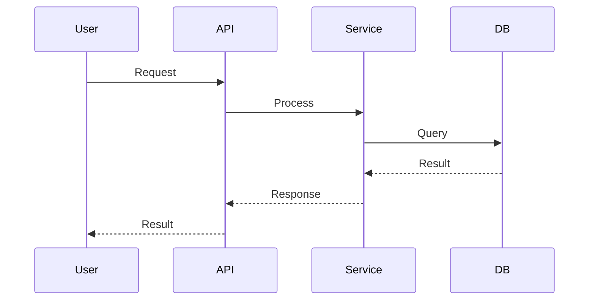

# $ARGUMENTS — Logic & Workflows

---
# METADATA
---
title: "Logic and Workflows"
app: "$ARGUMENTS"
template: "logic-and-workflows.template.md"
version: "4.0"
doc_version: "$DOC_VERSION"
generated_by: "AppDoc Agent v7.0"
generated_at: "$DATE_GENERATED"
code_last_modified: "$LAST_CODE_CHANGE_DATE"
sources_scanned: $SOURCES_SCANNED
test_files_analyzed: $TEST_FILE_COUNT
behavioral_contracts_extracted: $BEHAVIOR_CONTRACT_COUNT
---

## Executive Summary (2-3 sentences)
$LOGIC_EXECUTIVE_SUMMARY[CONFIDENCE:HIGH]

---

## 1. Execution Flow Overview

<details open>
<summary>High-Level Flow</summary>

- **Primary Entry Points:** $ENTRY_POINTS[CONFIDENCE:HIGH]
- **Initialization / Bootstrap Sequence:** $INITIALIZATION_STEPS[CONFIDENCE:HIGH]
- **Main Execution Flow:** $MAIN_EXECUTION_FLOW[CONFIDENCE:MEDIUM]
- **Shutdown / Cleanup:** $TERMINATION_LOGIC[CONFIDENCE:MEDIUM]

**Flow Diagram:**


</details>

---

## 2. Key Workflows & Business Processes (S→I→T→O→P Format)

Repeat the block below for every core workflow detected using the Sources → Inputs → Transformations → Outputs → Presentation format:

<details>
<summary>Workflow: $WORKFLOW_NAME</summary>

### Sources → Inputs → Transformations → Outputs → Presentation

| Source | Inputs | Transformations | Outputs | Presentation |
|--------|----------------|---------|--------------|
| $WORKFLOW_SOURCE | $WORKFLOW_INPUTS | $WORKFLOW_TRANSFORMATIONS | $WORKFLOW_OUTPUTS | $WORKFLOW_PRESENTATION |

### Workflow Details
- **Trigger/Event:** $WORKFLOW_TRIGGER[CONFIDENCE:HIGH]
- **Purpose / High-level description:** $WORKFLOW_DESCRIPTION[CONFIDENCE:HIGH]

### Execution Steps
1. $WORKFLOW_STEP_1[CONFIDENCE:HIGH]
2. $WORKFLOW_STEP_2[CONFIDENCE:HIGH]
3. $WORKFLOW_STEP_3[CONFIDENCE:MEDIUM]
   (Continue as needed)

### Error Handling & Recovery
- **Error Strategies:** $WORKFLOW_ERROR_LOGIC[CONFIDENCE:MEDIUM]
- **Retry Logic:** $WORKFLOW_RETRY_STRATEGY[CONFIDENCE:MEDIUM]
- **Fallback Behavior:** $WORKFLOW_FALLBACK[CONFIDENCE:LOW]

### Dependencies & Components
- **Linked Components:** $WORKFLOW_COMPONENT_LINKS[CONFIDENCE:HIGH]
- **External Dependencies:** $WORKFLOW_EXTERNAL_DEPS[CONFIDENCE:HIGH]

### Evidence & Traceability
- **Code Location:** $WORKFLOW_TRACE[CONFIDENCE:HIGH] (e.g., file:line)
- **Behavior Graph Evidence:** $WORKFLOW_BEHAVIOR_EVIDENCE (e.g., `behavior-graph.json#edge123`)
- **Test Coverage:** $WORKFLOW_TEST_FILES[CONFIDENCE:MEDIUM]
- **Confidence Level:** HIGH/MEDIUM/LOW
- **Inference Source:** Code analysis + Test mapping + Behavior graph + Config validation

</details>

(Repeat for each workflow)

---

## 3. API Endpoints & Programmatic Interfaces

<details>
<summary>REST/RPC Endpoints (click to expand)</summary>

| Endpoint / RPC | Method / Pattern | Purpose | Auth Required | Linked Logic | Test Coverage | Confidence |
|----------------|------------------|---------|---------------|--------------|---------------|------------|
| $API_ENDPOINT | $API_METHOD | $API_DESCRIPTION | $API_AUTH | $API_LOGIC_PATH | $API_TEST_COVERAGE | HIGH/MED/LOW |

**Authentication & Authorization:**

Example method/token values: JWT, API Key, OAuth2, SAML, Session Cookie. Use [CONFIDENCE:HIGH|MEDIUM|LOW] annotation for each value.
Method: $AUTH_METHOD[CONFIDENCE:MEDIUM]
Token type: $TOKEN_TYPE[CONFIDENCE:MEDIUM]
Validation logic: $AUTH_VALIDATION_LOCATION[CONFIDENCE:HIGH]

</details>

---

## 4. Background Jobs, Workers & Schedulers

For each background job:

<details>
<summary>Job: $JOB_NAME</summary>

### Sources → Inputs → Transformations → Outputs → Presentation

| Source | Inputs | Transformations | Outputs | Presentation |
|--------|--------|----------------|---------|--------------|
| $JOB_SOURCE | $JOB_INPUTS | $JOB_TRANSFORMATIONS | $JOB_OUTPUTS | $JOB_PRESENTATION |

- **Trigger / Schedule:** $JOB_TRIGGER[CONFIDENCE:HIGH]
- **Module Owner:** $JOB_MODULE[CONFIDENCE:HIGH]
- **Processing Steps:** $JOB_LOGIC_DESCRIPTION[CONFIDENCE:MEDIUM]
- **Retry / Error Strategies:** $JOB_RETRY_STRATEGY[CONFIDENCE:MEDIUM]
- **Dependencies:** $JOB_DEPENDENCIES[CONFIDENCE:HIGH]
- **Concurrency Model:** $JOB_CONCURRENCY[CONFIDENCE:LOW]
- **Evidence:** $JOB_TRACE[CONFIDENCE:HIGH]

</details>

---

## 5. Data Models & Transformations

<details>
<summary>Core Data Models (expand for details)</summary>

- **Key Data Models (Name + Purpose):** $DATA_MODELS_LIST[CONFIDENCE:HIGH]
- **Main Transformations / Mappings:** $DATA_MAPPINGS_SUMMARY[CONFIDENCE:MEDIUM]
- **Persistence Strategy:** $PERSISTENCE_NOTES[CONFIDENCE:MEDIUM]
- **Validation Rules:** $VALIDATION_RULES[CONFIDENCE:MEDIUM]

### Schema Overview
```
User Model
  ├─ Properties: id, email, name, created_at
  ├─ Validation: email required, name 3-50 chars
  └─ Persistence: users table (PostgreSQL)
```

</details>

---

## 6. Error Handling, Logging & Diagnostics

- **Global Error Handling Strategy:** $ERROR_HANDLING_STRATEGY[CONFIDENCE:HIGH]
- **Logging Format & Locations:** $LOGGING_STRATEGY[CONFIDENCE:MEDIUM]
- **Log Levels Used:** $LOG_LEVELS[CONFIDENCE:HIGH]
- **Common Exception Types:** $COMMON_EXCEPTIONS[CONFIDENCE:HIGH]
- **Known Retry Logic & Circuit Breakers:** $RETRY_CIRCUITLOGIC[CONFIDENCE:MEDIUM]
- **Monitoring Integration:** $MONITORING_INTEGRATION[CONFIDENCE:LOW]

---

## 7. Unit & Integration Tests (Mapping)

### Test Coverage Summary
- **Total Test Files:** $TEST_FILE_COUNT[CONFIDENCE:HIGH]
- **Test Framework:** $TEST_FRAMEWORK[CONFIDENCE:HIGH]
- **Coverage Estimate:** $COVERAGE_ESTIMATE[CONFIDENCE:MEDIUM]

<details>
<summary>Test-to-Source Mapping (click to expand)</summary>

| Test File | Source File | Test Count | Coverage Level | Confidence |
|-----------|-------------|------------|----------------|------------|
| $TEST_FILE_NAME | $SOURCE_FILE_NAME | $TEST_COUNT | HIGH/MEDIUM/LOW | HIGH/MED/LOW |

</details>

### Key Test Fixtures & Data
- **Fixture Locations:** $TEST_FIXTURE_NOTES[CONFIDENCE:MEDIUM]
- **Mock/Stub Strategy:** $MOCK_STRATEGY[CONFIDENCE:MEDIUM]
- **Test Data Sources:** $TEST_DATA_SOURCES[CONFIDENCE:MEDIUM]

### Uncovered Areas (Tests Missing)
- $TESTING_GAPS[CONFIDENCE:HIGH]
- Priority recommendations: See `Documentation Tasks.md` for P1 test coverage tasks

---

## 8. Behavioral Contracts (Inferred from Tests)

**Note:** These contracts are extracted from test assertions and represent the *intended behavior* of the system.

<details>
<summary>Contract: $FUNCTION_NAME</summary>

### Function/Class: $FUNCTION_SIGNATURE
**Source:** $FUNCTION_SOURCE_LOCATION[CONFIDENCE:HIGH]

### Expected Behaviors (from tests)

#### Scenario 1: $TEST_SCENARIO_NAME
- **GIVEN:** $TEST_SETUP_CONDITION[CONFIDENCE:HIGH]
- **WHEN:** $TEST_ACTION[CONFIDENCE:HIGH]
- **THEN:** $TEST_ASSERTION[CONFIDENCE:HIGH]
- **Test Source:** $TEST_FILE_LOCATION[CONFIDENCE:HIGH]

#### Scenario 2: $TEST_SCENARIO_NAME_2
- **GIVEN:** $TEST_SETUP_CONDITION_2[CONFIDENCE:HIGH]
- **WHEN:** $TEST_ACTION_2[CONFIDENCE:HIGH]
- **THEN:** $TEST_ASSERTION_2[CONFIDENCE:HIGH]
- **Test Source:** $TEST_FILE_LOCATION_2[CONFIDENCE:HIGH]

### Edge Cases Covered
- $EDGE_CASE_1[CONFIDENCE:HIGH]
- $EDGE_CASE_2[CONFIDENCE:MEDIUM]

### Missing Test Coverage (Recommended)
- $UNTESTED_SCENARIO_1[CONFIDENCE:MEDIUM]
- $UNTESTED_SCENARIO_2[CONFIDENCE:LOW]

### Confidence Assessment
- **Overall Confidence:** HIGH/MEDIUM/LOW
- **Reason:** $CONFIDENCE_JUSTIFICATION

</details>

(Repeat for each critical function/class with test coverage)

---

## 9. Troubleshooting Cross-References

- For known failure modes referenced here, link to the Troubleshooting Playbook: `troubleshooting.playbook.md`
- Common error patterns: See section 6 and `troubleshooting.playbook.md` section 2
- Recovery procedures: See `troubleshooting.playbook.md` section 3

---

## 10. References

### Related Documentation
- Architecture: `architecture.md`
- Audit Report: `audit-report.md`
- Documentation Tasks: `Documentation Tasks.md`
- Inference Evidence: `inference-evidence.md`
- Change Impact Map: `change-impact-map.md`
- Cognitive Audit: `cognitive-audit.md` (NEW)
- Developer Preflight: `developer-preflight.md` (NEW)

### Source Evidence
- Test mapping: `.meta/test-coverage-map.json`
- Component dependencies: `.meta/component-map.json`
- **NEW**: Behavior graph: `.meta/behavior-graph.json`
- **NEW**: System integrations: `.meta/system-integrations.json`
- Behavioral contracts: Extracted from $TEST_FILE_COUNT test files

### Version Control
- Current version: v$DOC_VERSION
- Previous version: v$PREV_DOC_VERSION
- Changes: See `CHANGELOG.md`

---

## Quick Reference for Developers

### Common Tasks
- **Adding a new API endpoint:** Review section 3 for patterns, check auth requirements
- **Modifying a workflow:** Check section 2 for dependencies, review `change-impact-map.md`
- **Understanding error handling:** See section 6 and `troubleshooting.playbook.md`
- **Running tests:** See section 7 for test framework and coverage

### Before Making Changes
1. Check `change-impact-map.md` for component dependencies
2. Review behavioral contracts (section 8) to understand expected behavior
3. Verify test coverage (section 7) for areas you're modifying
4. Check `Documentation Tasks.md` for any known issues in that area
5. **NEW**: Review `cognitive-audit.md` for fragility analysis
6. **NEW**: Check `developer-preflight.md` for component modification guidelines

*(end of logic-and-workflows document)*
