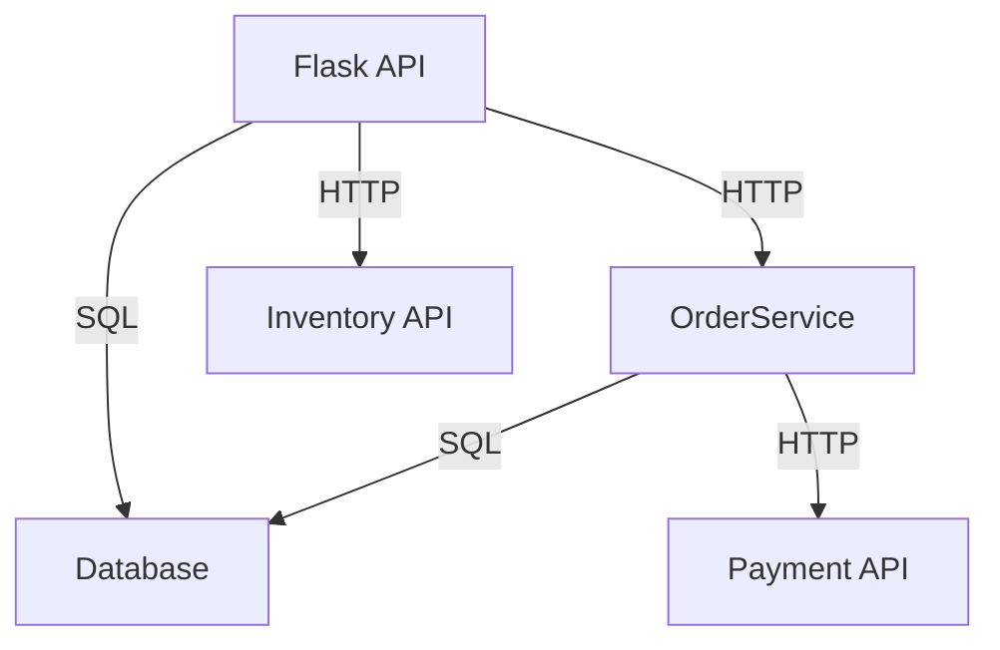
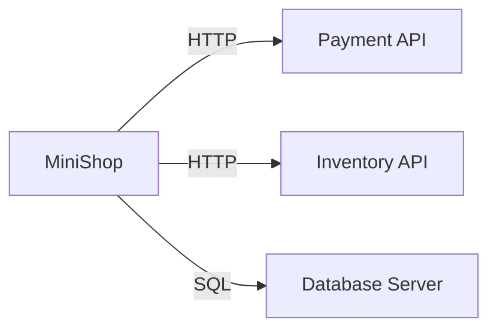

# MiniShop Architecture

## System Thesis
A multi-tier e-commerce application with REST API, business logic service, and SQL database layers.

## Layered Overview

### Controller Layer (API)
- **Technology**: Python Flask
- **Purpose**: HTTP request handling and response formatting
- **Components**: 
  - `/api/products` - Product catalog management
  - `/api/orders` - Order creation and management

### Service Layer (Business Logic)
- **Technology**: C#
- **Purpose**: Core business logic and transaction processing
- **Components**:
  - `OrderService` - Order management and payment processing

### Repository Layer (Database)
- **Technology**: SQL (SQLite/SQL Server)
- **Purpose**: Data persistence and retrieval
- **Tables**: products, users, orders, order_items, inventory, payment_transactions

### External Dependencies
- Payment API (`https://payment-api.example.com`)
- Inventory API (`https://inventory-api.example.com`)


## Communication & Protocols
- **Controller → Service**: REST/HTTP
- **Service → Repository**: Direct DB calls (SQL/ORM)
- **Service → External APIs**: REST/HTTP with authentication

## Interaction Patterns
- **Order Creation**: Synchronous (Controller → Service → Payment → DB)
- **Inventory Reservation**: Asynchronous (Service triggers webhook/queue to Inventory API)
- **Payment Processing**: Synchronous (Service → Payment API)

## Deployment Topology
- Components are co-located on a single host for development; can be distributed as separate services or containers in production (Docker/Kubernetes supported)

## Internal Component Graph


## External Integrations


## Example Data Flow: Creating an Order
1. User sends order request to `/api/orders` (HTTP)
2. Controller validates request and forwards to `OrderService`
3. `OrderService` validates business rules
4. `OrderService` calls Payment API (HTTP, synchronous)
5. On success, `OrderService` writes order and payment to Database (SQL transaction)
6. `OrderService` triggers inventory reservation (HTTP/webhook, asynchronous)
7. Controller returns order confirmation to user

## External Integrations
```mermaid
graph LR
    A[MiniShop] --> B[Payment API]
    A --> C[Inventory API]
    A --> D[Database Server]
